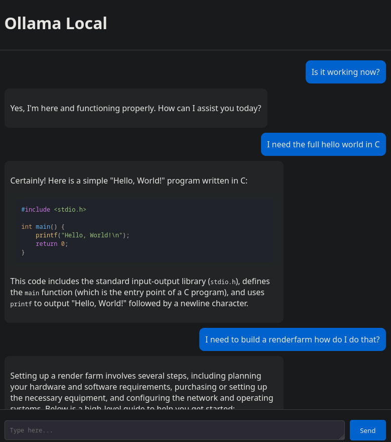

# ClaudeOllamaLocal

## 🔒 100% Local. NDA & TPN-Ready Private Coding Assistant

**ClaudeOllamaLocal** is a truly private, self-hosted coding assistant powered by local large language models. No data ever leaves your machine. Built for high-trust environments and sensitive intellectual property, it is suitable for workflows subject to strict NDAs, legal requirements, and TPN best practices.*

<p align="center">
  
</p>

---

## 🛡️ NDA & TPN Compliance Statement

> **ClaudeOllamaLocal can be operated to align with NDA (Non-Disclosure Agreement) and TPN (Trusted Partner Network) compliance requirements, provided it is deployed and used on secure, isolated hardware as part of a compliant organizational environment.**

### Details

- **NDA Compliance:**  
  - No third-party or cloud services: All data, source code, and chat prompts remain on local hardware.
  - No telemetry, analytics, or tracking: Nothing is collected or reported externally.
  - No persistent data: Chat history is maintained only in RAM during runtime, not written to disk or synced.
  - Fully auditable under GPL-3.0 license—organizations and auditors can review all source code and data flows.
  - It is the user’s responsibility to run the software on hardware and networks that meet their organizational NDA policies.

- **TPN (Trusted Partner Network) Compliance:**  
  - No external connections: Does not rely on any SaaS or remote inference APIs.
  - No data egress: The application, by design, prevents any outbound data transfer.
  - Compatible with air-gapped and high-security network policies.
  - No external libraries or closed binaries outside of dependencies required for FastAPI and Ollama (all open source).
  - Physical and operational TPN compliance depends on your overall environment and controls.

> **NOTE:** While ClaudeOllamaLocal is designed to make NDA and TPN compliance straightforward, ultimate compliance is determined by your operational procedures and IT environment.

---

## ✨ Privacy & Security Features

- **All AI Processing Local:** Uses [Ollama](https://ollama.com/) LLMs running on your own server (`localhost`).
- **No Telemetry, No Cloud APIs:** No prompts, code, or outputs ever leave your machine.
- **No Network Exposure By Default:** Backend binds only to `localhost`. You control access.
- **Ephemeral Memory:** Conversations are kept in RAM for active sessions only.
- **Open Source:** 100% auditable for code review or security approval processes.

---

## 🚀 Quick Start

### 1. Prerequisites

- [Ollama](https://ollama.com/) (LLM service, running locally on `localhost:11434`)
- Python 3.8+

### 2. One-Line Setup

```bash
git clone https://github.com/MarkChisholm-dev/ClaudeOllamaLocal.git
cd ClaudeOllamaLocal
python setup_agent.py
```

### 3. Start the Server

```bash
python main.py
```

Visit [http://localhost:8000](http://localhost:8000) on your machine.

---

## 🛡️ Architecture Overview

- **Frontend:** FastAPI web UI connects only to the local backend.
- **Backend:** FastAPI Python server, only communicates with local Ollama instance (`localhost`).
- **CLI:** Universal helper script for direct local LLM chat—no external calls.

**No remote endpoints, tokens, or network calls to the Internet or third parties.**

---

## ⚠️ Important

- To remain NDA and TPN compliant, deploy on isolated hardware and networks under your organizational control.
- Do NOT expose the backend or Ollama API to public networks.
- Review your local configuration, environment, and access policies as part of a compliant deployment.

---

## 📝 License

GPL-3.0 – free to use, modify, and examine.

---

## ❤️ Contributions

Issues and improvements are welcome, with respect for user privacy and compliance goals.

---

*This project is not a legal authority. For official NDA or TPN certification, consult your legal and IT security teams as well as TPN security assessors.*
